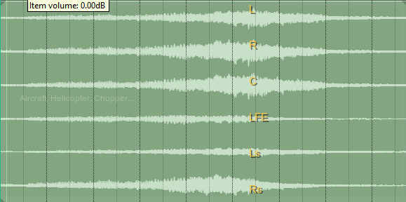

# REAPER Audio Post Scripts

Custom REAPER scripts and JSFX for audio post-production, film sound, mixing, surround, immersive audio, and audio analysis.

---

# SurroundScope Multimeter

**SurroundScope Multimeter** is a multichannel audio analysis and metering system for REAPER, designed for audio post-production, surround, and immersive audio workflows.

It consists of two components:

- **SurroundScope Multimeter Analyzer** — JSFX analysis engine
- **SurroundScope Multimeter Dashboard** — ReaImGui visualization interface

The analyzer performs the audio analysis and publishes the data through REAPER's `gmem` system. The dashboard visualizes that data in real time.

---

## Features

### Multichannel Meters

- Up to 64 REAPER channels
- Peak metering
- RMS metering
- Peak hold
- Crest factor
- Sample peak
- Adjustable meter response
- Horizontal and vertical meter layouts
- Multiple meter scale presets

### Waveform

- Real-time waveform/envelope display
- Up to 24 channels for waveform visualization
- Adjustable waveform update rate
- Multiple display themes
- Smooth rolling waveform
- Horizontal and vertical display modes
- Transport-aware scrolling

### Spectrum Analyzer

- 20 Hz – 20 kHz frequency range
- 48 logarithmic frequency bands
- Spectrum smoothing
- Peak hold
- Real-time spectrum visualization

### Loudness & Phase

- Momentary loudness
- Short-term loudness
- Integrated loudness
- Peak
- RMS
- Crest factor
- L/R correlation
- Loudness history

The analyzer uses **BS.1770-style K-weighting** for its loudness analysis.

> Loudness measurements are analysis estimates. For compliance and delivery, use an approved standards-compliant loudness meter.

### Surround Scope

Visualizes energy distribution across multichannel and immersive speaker layouts.

Supported speaker positions include:

- L
- R
- C
- LFE
- Ls
- Rs
- Lrs
- Rrs
- Ltf
- Rtf
- Ltr
- Rtr

The scope provides:

- Surround energy visualization
- Speaker-position visualization
- Energy centroid
- Surround width
- Field focus

### Channel Details

Provides per-channel information including:

- Peak
- RMS
- Peak hold
- Crest factor
- Sample peak

---

# Components

## SurroundScope Multimeter Analyzer

**File:** `JSFX/SurroundScope_Multimeter.jsfx`

The JSFX is the analysis engine behind SurroundScope Multimeter.

It analyzes the incoming REAPER audio and publishes measurement data to the dashboard through REAPER's shared `gmem` system.

### Analyzer capabilities

- Up to 64 REAPER channels
- Per-channel peak analysis
- RMS analysis
- Peak hold
- Crest factor
- Sample peak
- Waveform analysis
- Spectrum analysis
- Loudness analysis
- K-weighting
- L/R correlation
- Loudness history
- Configurable analysis rates
- Multiple analyzer slots

---

## SurroundScope Multimeter Dashboard

**File:** `Scripts/SurroundScope_Multimeter_Dashboard.lua`

The dashboard is a ReaImGui-based interface for visualizing the analyzer data.

It provides six analysis modules:

1. Meters
2. Waveform
3. Spectrum
4. Loudness
5. Scope
6. Details

The dashboard communicates with the companion JSFX through REAPER's `gmem` system.

---

# Screenshots

## Multichannel Meters

## Waveform

## Spectrum Analyzer

## Loudness & Phase

## Surround Scope

---

# Requirements

- [REAPER](https://www.reaper.fm/)
- ReaImGui
- SurroundScope Multimeter Analyzer JSFX
- SurroundScope Multimeter Dashboard Lua script

---

# Installation

## 1. Install ReaImGui

Install the ReaImGui extension for REAPER.

The dashboard requires ReaImGui for its graphical interface.

## 2. Install the Analyzer

Install `JSFX/SurroundScope_Multimeter.jsfx` into your REAPER Effects / JSFX directory.

## 3. Install the Dashboard

Install `Scripts/SurroundScope_Multimeter_Dashboard.lua` into your REAPER Scripts directory.

The script can then be loaded from:

`REAPER → Actions → Show action list`

Search for:

`SurroundScope Multimeter Dashboard`

---

# Basic Setup

### 1. Insert the Analyzer

Insert the **SurroundScope Multimeter Analyzer** JSFX on the audio path you want to analyze.

Audio Track / Bus  
↓  
SurroundScope Multimeter Analyzer  
↓  
Audio Output

### 2. Select an Analyzer Slot

Choose an Analyzer Slot in the JSFX.

Example:

`Analyzer Slot: 1`

### 3. Launch the Dashboard

Run:

`SurroundScope Multimeter Dashboard`

from the REAPER Action List.

### 4. Select the Same Slot

Set the dashboard to the same Analyzer Slot.

`JSFX Slot: 1`  
`Dashboard Slot: 1`

The dashboard will then receive and display the analyzer data.

---

# Data Communication

The analyzer and dashboard communicate through REAPER's shared `gmem` system.

REAPER AUDIO  
↓  
SurroundScope Analyzer JSFX  
↓  
gmem  
↓  
SurroundScope Dashboard  
↓  
Meters / Waveform / Spectrum / Loudness / Scope

The dashboard primarily acts as a visualization and control interface. It does not modify audio routing, automation, or project state.

---

# Analyzer Slots

Multiple analyzer slots allow different analyzer instances to communicate with the dashboard independently.

Example:

Track / Bus A  
↓  
Analyzer Slot 1  
↓  
Dashboard Slot 1

Track / Bus B  
↓  
Analyzer Slot 2  
↓  
Dashboard Slot 2

The analyzer and dashboard must use the same slot.

---

# Supported Formats

The dashboard provides format options for:

- Stereo
- 5.1
- 7.1
- 7.1.4

Channel-order options include:

- ITU
- Film
- SMPTE

The analyzer itself supports up to **64 REAPER channels**.

---

# Development

This repository contains custom tools developed for practical REAPER audio workflows, with a focus on:

- Film sound
- Re-recording mixing
- Sound design
- Multichannel mixing
- Surround workflows
- Immersive audio
- Audio metering
- Audio analysis
- REAPER workflow development

---

# License

This project is released under the MIT License.

See [`LICENSE`](LICENSE) for details.

---

# Author

**Ebin Augustin**

Audio Engineer · Sound Designer · Music Producer

Custom REAPER tools for audio post-production and immersive audio workflows.

# WAVEXT Channel Labels

A REAPER ReaScript overlay that displays **WAVEXT channel labels directly over the waveform lanes of selected multichannel media items**.

The script reads the channel configuration from WAV/WAVEXT metadata and places the corresponding channel names at the location of the strongest shared waveform peak.

---

## Screenshot

---

## Features

- Displays channel labels directly over selected multichannel media items
- Reads channel configuration from WAVEXT metadata
- Supports multichannel WAV files
- Automatically detects the number of source channels
- Uses the WAVEXT channel mask to determine channel names
- Calculates the strongest peak for each channel
- Uses a shared peak position to align all channel labels as a column
- Labels remain centered within their individual waveform lanes
- Labels follow the REAPER Arrange View while scrolling and zooming
- Automatically handles different track heights
- Supports high-DPI displays
- Runs as a toggleable REAPER action
- Caches peak analysis for improved performance

---

## Channel Labels

| Channel | Label |
|---:|:---|
| 1 | L |
| 2 | R |
| 3 | C |
| 4 | LFE |
| 5 | Lb |
| 6 | Rb |
| 7 | Lc |
| 8 | Rc |
| 9 | Cs |
| 10 | Ls |
| 11 | Rs |
| 12 | Tc |
| 13 | Tfl |
| 14 | Tfc |
| 15 | Tfr |
| 16 | Tbl |
| 17 | Tbc |
| 18 | Tbr |

If a channel is not included in the predefined mapping, the script displays a generic label such as `Ch 19`.

---

## How It Works

The script works as an overlay on top of REAPER's Arrange View.

    Selected Multichannel Media Item
                  │
                  ▼
           Read WAV/WAVEXT Data
                  │
                  ▼
          Determine Channel Mask
                  │
                  ▼
            Generate Labels
                  │
                  ▼
         Analyze Waveform Peaks
                  │
                  ▼
         Find Shared Peak Position
                  │
                  ▼
         Draw Labels Over Lanes

The overlay does not modify the media item or audio data.

---

## WAVEXT Channel Detection

The script first attempts to obtain the channel configuration from the WAV file header.

It checks the WAV `fmt ` chunk for the extensible WAV format and reads the channel mask.

If the embedded channel mask is unavailable, the script also checks REAPER media metadata for WAVEXT-related channel configuration information.

The channel mask is then converted into the corresponding channel labels.

---

## Peak-Based Label Positioning

The script analyzes the selected item's audio using REAPER's `CreateTakeAudioAccessor()`.

For each channel it determines:

- Peak amplitude
- Peak position in time

It also determines a **shared peak position** based on the strongest sample across all channels.

This shared position is used to align the channel labels vertically.

---

## Label Position

Each label is positioned at the center of its corresponding waveform lane.

The waveform peak determines the **horizontal position** of the labels.

The channel lane determines the **vertical position**.

This keeps labels aligned consistently even when channel amplitudes differ.

---

## Supported Media

The script is intended for **multichannel media items**.

Only selected media items with more than one source channel are processed.

Mono items are ignored.

---

## Requirements

- [REAPER](https://www.reaper.fm/)
- **ReaImGui**
- **js_ReaScriptAPI**

The script uses:

- ReaImGui for overlay rendering
- js_ReaScriptAPI for access to REAPER's Arrange View window

---

## Installation

### 1. Install ReaImGui

Install the ReaImGui extension for REAPER.

### 2. Install js_ReaScriptAPI

Install the **js_ReaScriptAPI** extension.

### 3. Install the Script

Copy the Lua script into your REAPER Scripts directory.

For example:

`Scripts/WAVEXT_Channel_Labels.lua`

Then open:

`Actions → Show action list`

and load the script.

---

## Usage

### 1. Select a Multichannel Media Item

Select one or more multichannel media items in the Arrange View.

### 2. Run the Script

Run the WAVEXT Channel Labels script from the REAPER Action List.

### 3. View the Labels

The channel labels will appear directly over the waveform lanes.

### 4. Toggle the Overlay

Run the same action again to disable the overlay.

---

## Performance

Peak analysis is cached per take using the take GUID.

This prevents the script from repeatedly scanning the same audio whenever the overlay refreshes.

---

## Limitations

- Requires ReaImGui and js_ReaScriptAPI.
- Only selected media items are processed.
- Mono media items are ignored.
- Channel labels depend on a valid WAVEXT/channel-mask configuration.
- If the channel configuration cannot be resolved, generic channel labels are used.
- Peak analysis operates on the take audio accessed by REAPER's audio accessor.
- The script is designed specifically as a visual Arrange View overlay.

---

## Use Cases

- Film sound editing
- Multichannel WAV editing
- Surround sound workflows
- Immersive audio workflows
- Channel identification
- Dialogue editing
- Foley editing
- Sound effects editing
- Multichannel field recordings
- Checking channel layouts directly in the Arrange View

---

## Technical Details

The script uses:

- `ReaImGui`
- `js_ReaScriptAPI`
- REAPER Media Source APIs
- REAPER Audio Accessors
- WAV RIFF/WAVE header parsing
- WAV extensible channel masks
- REAPER media metadata
- Arrange View coordinates
- Peak analysis and caching

The overlay is drawn using an ImGui draw list positioned over REAPER's Arrange View.

---

## License

This project is released under the MIT License.

See [`LICENSE`](LICENSE) for details.

---

## Author

**Ebin Augustin**

Audio Engineer · Sound Designer · Music Producer

Custom REAPER tools for audio post-production, multichannel workflows, and immersive audio.
