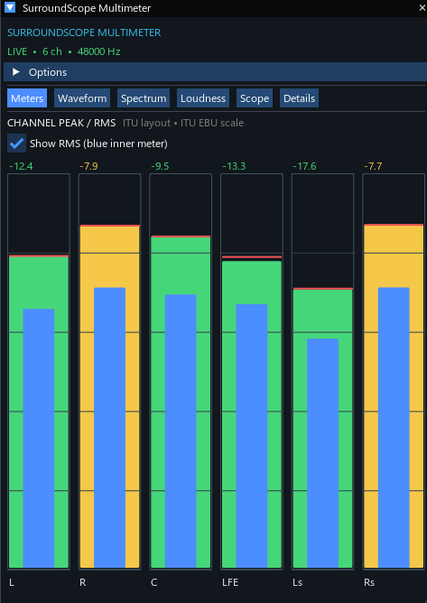
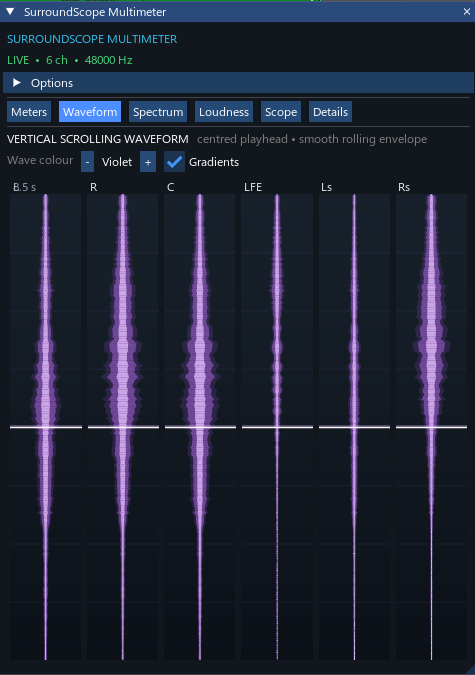
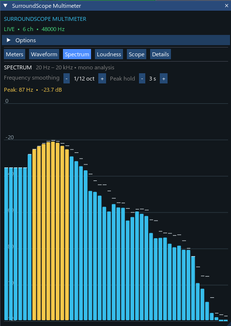
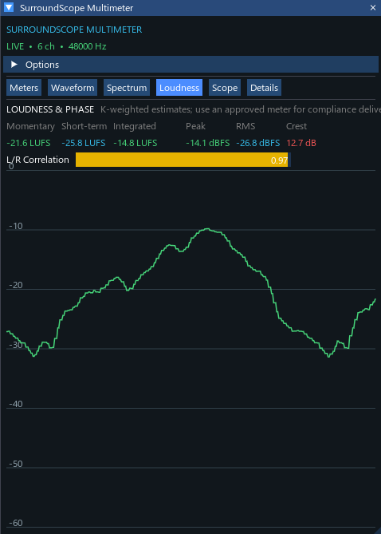

# REAPER Audio Post Scripts

Custom REAPER scripts and JSFX for audio post-production, film sound, mixing, surround, immersive audio, and audio analysis.

---

# SurroundScope Multimeter

**SurroundScope Multimeter** is a multichannel audio analysis and metering system for REAPER, designed for audio post-production, surround, and immersive audio workflows.

It consists of two components:

- **SurroundScope Multimeter Analyzer** — JSFX analysis engine
- **SurroundScope Multimeter Dashboard** — ReaImGui visualization interface

The analyzer performs the audio analysis and publishes the data through REAPER's `gmem` system. The dashboard visualizes that data in real time.

---

## Features

### Multichannel Meters

- Up to 64 REAPER channels
- Peak metering
- RMS metering
- Peak hold
- Crest factor
- Sample peak
- Adjustable meter response
- Horizontal and vertical meter layouts
- Multiple meter scale presets

### Waveform

- Real-time waveform/envelope display
- Up to 24 channels for waveform visualization
- Adjustable waveform update rate
- Multiple display themes
- Smooth rolling waveform
- Horizontal and vertical display modes
- Transport-aware scrolling

### Spectrum Analyzer

- 20 Hz – 20 kHz frequency range
- 48 logarithmic frequency bands
- Spectrum smoothing
- Peak hold
- Real-time spectrum visualization

### Loudness & Phase

- Momentary loudness
- Short-term loudness
- Integrated loudness
- Peak
- RMS
- Crest factor
- L/R correlation
- Loudness history

The analyzer uses **BS.1770-style K-weighting** for its loudness analysis.

> Loudness measurements are analysis estimates. For compliance and delivery, use an approved standards-compliant loudness meter.

### Surround Scope

Visualizes energy distribution across multichannel and immersive speaker layouts.

Supported speaker positions include:

- L
- R
- C
- LFE
- Ls
- Rs
- Lrs
- Rrs
- Ltf
- Rtf
- Ltr
- Rtr

The scope provides:

- Surround energy visualization
- Speaker-position visualization
- Energy centroid
- Surround width
- Field focus

### Channel Details

Provides per-channel information including:

- Peak
- RMS
- Peak hold
- Crest factor
- Sample peak

---

# Components

## SurroundScope Multimeter Analyzer

**File:** `JSFX/SurroundScope_Multimeter.jsfx`

The JSFX is the analysis engine behind SurroundScope Multimeter.

It analyzes the incoming REAPER audio and publishes measurement data to the dashboard through REAPER's shared `gmem` system.

### Analyzer capabilities

- Up to 64 REAPER channels
- Per-channel peak analysis
- RMS analysis
- Peak hold
- Crest factor
- Sample peak
- Waveform analysis
- Spectrum analysis
- Loudness analysis
- K-weighting
- L/R correlation
- Loudness history
- Configurable analysis rates
- Multiple analyzer slots

---

## SurroundScope Multimeter Dashboard

**File:** `Scripts/SurroundScope_Multimeter_Dashboard.lua`

The dashboard is a ReaImGui-based interface for visualizing the analyzer data.

It provides six analysis modules:

1. Meters
2. Waveform
3. Spectrum
4. Loudness
5. Scope
6. Details

The dashboard communicates with the companion JSFX through REAPER's `gmem` system.

---

# Screenshots

## Multichannel Meters

## Waveform

## Spectrum Analyzer

## Loudness & Phase

## Surround Scope

---

# Requirements

- [REAPER](https://www.reaper.fm/)
- ReaImGui
- SurroundScope Multimeter Analyzer JSFX
- SurroundScope Multimeter Dashboard Lua script

---

# Installation

## 1. Install ReaImGui

Install the ReaImGui extension for REAPER.

The dashboard requires ReaImGui for its graphical interface.

## 2. Install the Analyzer

Install `JSFX/SurroundScope_Multimeter.jsfx` into your REAPER Effects / JSFX directory.

## 3. Install the Dashboard

Install `Scripts/SurroundScope_Multimeter_Dashboard.lua` into your REAPER Scripts directory.

The script can then be loaded from:

`REAPER → Actions → Show action list`

Search for:

`SurroundScope Multimeter Dashboard`

---

# Basic Setup

### 1. Insert the Analyzer

Insert the **SurroundScope Multimeter Analyzer** JSFX on the audio path you want to analyze.

Audio Track / Bus  
↓  
SurroundScope Multimeter Analyzer  
↓  
Audio Output

### 2. Select an Analyzer Slot

Choose an Analyzer Slot in the JSFX.

Example:

`Analyzer Slot: 1`

### 3. Launch the Dashboard

Run:

`SurroundScope Multimeter Dashboard`

from the REAPER Action List.

### 4. Select the Same Slot

Set the dashboard to the same Analyzer Slot.

`JSFX Slot: 1`  
`Dashboard Slot: 1`

The dashboard will then receive and display the analyzer data.

---

# Data Communication

The analyzer and dashboard communicate through REAPER's shared `gmem` system.

REAPER AUDIO  
↓  
SurroundScope Analyzer JSFX  
↓  
gmem  
↓  
SurroundScope Dashboard  
↓  
Meters / Waveform / Spectrum / Loudness / Scope

The dashboard primarily acts as a visualization and control interface. It does not modify audio routing, automation, or project state.

---

# Analyzer Slots

Multiple analyzer slots allow different analyzer instances to communicate with the dashboard independently.

Example:

Track / Bus A  
↓  
Analyzer Slot 1  
↓  
Dashboard Slot 1

Track / Bus B  
↓  
Analyzer Slot 2  
↓  
Dashboard Slot 2

The analyzer and dashboard must use the same slot.

---

# Supported Formats

The dashboard provides format options for:

- Stereo
- 5.1
- 7.1
- 7.1.4

Channel-order options include:

- ITU
- Film
- SMPTE

The analyzer itself supports up to **64 REAPER channels**.

---

# Development

This repository contains custom tools developed for practical REAPER audio workflows, with a focus on:

- Film sound
- Re-recording mixing
- Sound design
- Multichannel mixing
- Surround workflows
- Immersive audio
- Audio metering
- Audio analysis
- REAPER workflow development

---

# License

This project is released under the MIT License.

See [`LICENSE`](LICENSE) for details.

---

# Author

**Ebin Augustin**

Audio Engineer · Sound Designer · Music Producer

Custom REAPER tools for audio post-production and immersive audio workflows.
